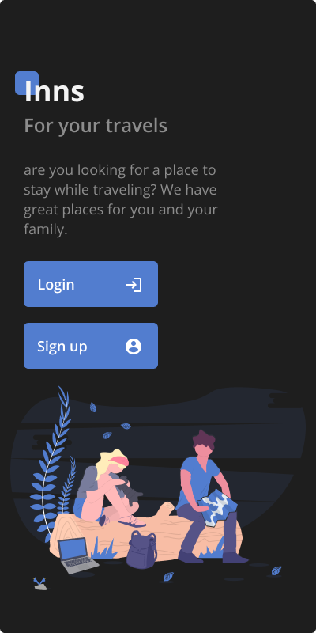
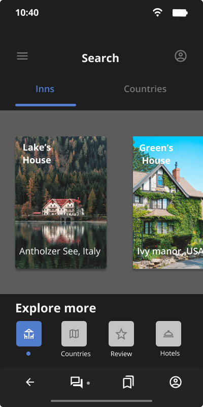
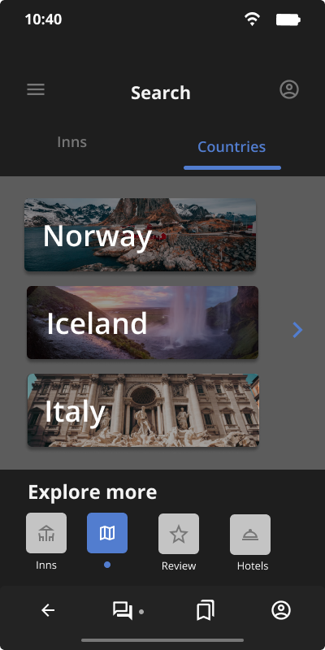
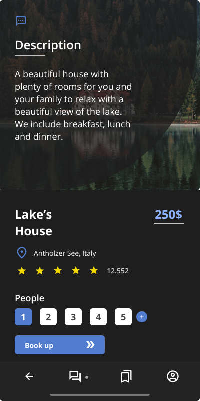

# Travel App Project
(It's just layout so there's no backend.)

This is a design of a travel inns and establishments app that I developed with Adobe XD and Figma programs.
I also put some things I learned about UX / UI into it.

Images, svg's and icons i used:

https://undraw.co/ 
https://unsplash.com/ 
https://fonts.google.com/icons

</img>
</img>
</img>
</img>
</img>

